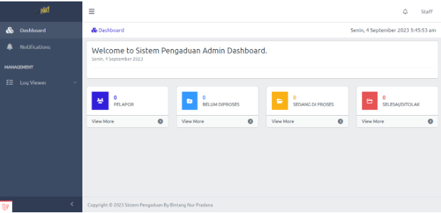

**Report System**

Sistem Pengaduan adalah sebuah platform yang dirancang untuk memfasilitasi masyarakat dalam menyampaikan keluhan, masukan, dan pengaduan terkait berbagai aspek layanan dan kondisi di suatu wilayah. Sistem ini bertujuan untuk meningkatkan transparansi, akuntabilitas, dan responsivitas pemerintah dalam menangani isu-isu yang dihadapi oleh warga, serta memperkuat hubungan antara pemerintah dan masyarakat.

Dengan menggunakan Sistem Pengaduan, warga dapat dengan mudah mengajukan pengaduan melalui situs web resmi. Mekanisme ini memberikan akses yang lebih luas dan fleksibel bagi masyarakat untuk menyampaikan masukan mereka, tanpa harus datang langsung ke kantor pemerintah.

**Developed By 2023 (BE) Bintang Nur Pradana**

**ERD**

**Dokumentasi**

1. **Categories Seeder**

2. **Status Seeder**

3. **Halaman Pelapor**

4. **Halaman Login Admin/ Staff**

5. **Halaman Dashboard**

6. **Halaman Kategori**

    

7. **Halaman Daftar Pelapor**

    

8. **Halaman Aktifitas Log**

    

9. **Halaman Daftar Laporan**

    

10. **Riwayat Laporan**

    

11. **Formulir ganti status pada staff/Admin**

    
